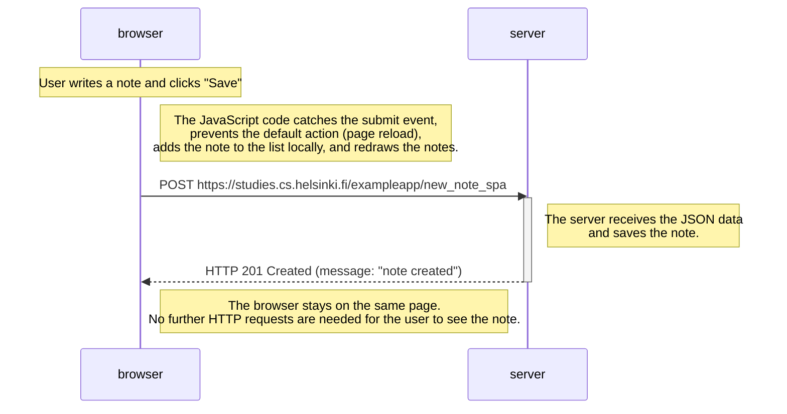

```mermaid
sequenceDiagram
    participant browser
    participant server

    Note over browser: User writes a note and clicks "Save"

    Note right of browser: The JavaScript code catches the submit event,<br/>prevents the default action (page reload),<br/>adds the note to the list locally, and redraws the notes.

    browser->>server: POST https://studies.cs.helsinki.fi/exampleapp/new_note_spa
    activate server
    Note right of server: The server receives the JSON data<br/>and saves the note.
    server-->>browser: HTTP 201 Created (message: "note created")
    deactivate server

    Note right of browser: The browser stays on the same page.<br/>No further HTTP requests are needed for the user to see the note.
```