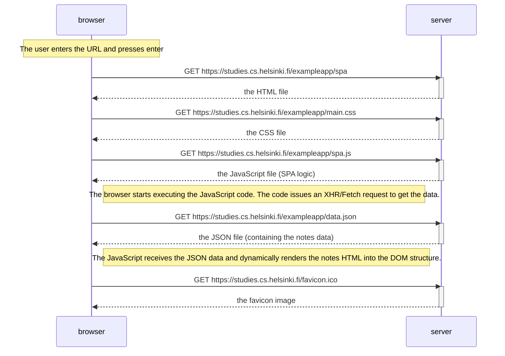

```mermaid
sequenceDiagram
    participant browser
    participant server

    Note over browser: The user enters the URL and presses enter

    browser->>server: GET https://studies.cs.helsinki.fi/exampleapp/spa
    activate server
    server-->>browser: the HTML file
    deactivate server

    browser->>server: GET https://studies.cs.helsinki.fi/exampleapp/main.css
    activate server
    server-->>browser: the CSS file
    deactivate server

    %% In the SPA version, it often loads a different JS file, e.g., spa.js
    browser->>server: GET https://studies.cs.helsinki.fi/exampleapp/spa.js
    activate server
    server-->>browser: the JavaScript file (SPA logic)
    deactivate server

    Note right of browser: The browser starts executing the JavaScript code. The code issues an XHR/Fetch request to get the data.

    browser->>server: GET https://studies.cs.helsinki.fi/exampleapp/data.json
    activate server
    server-->>browser: the JSON file (containing the notes data)
    deactivate server

    Note right of browser: The JavaScript receives the JSON data and dynamically renders the notes HTML into the DOM structure.

    browser->>server: GET https://studies.cs.helsinki.fi/favicon.ico
    activate server
    server-->>browser: the favicon image
    deactivate server
```